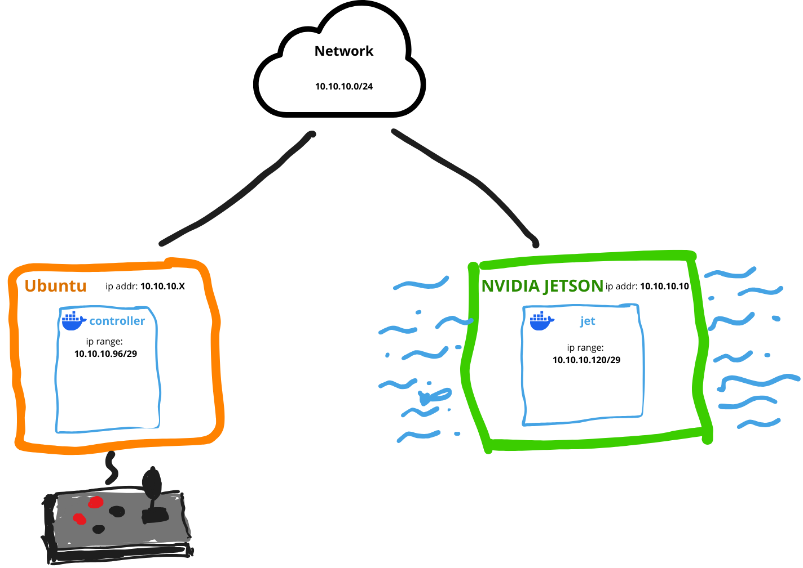

# ROS2-MARINES
## Architecture

The project architecture is based on Docker, which facilitates rapid deployment and allows for operation in nearly any configuration. To ensure proper control of the robot, the controlling computer must maintain a connection with the Nvidia Jetson. This setup maximizes flexibility and responsiveness in various operational environments, making it suitable for diverse applications in robotics and automation.

Project has two submodules with ROS2 packages:
- [Marines-Controll-Packages](https://github.com/PFlak/Marines-Controller-Packages)
- [Marines-Jet-Packages](https://github.com/PFlak/Marines-Jet-Packages)

### Example connection


### External Devices

#### USB

Devices connected to each host are accessible from docker container run on host

#### Ethernet

Devices are availability depends on network settings. In general devices in the same network should work both on ubuntu device and Nvidia Jetson

### File structure
```bash
.
├── compose.dev.yml
├── compose.prod.yml
├── controller
│   ├── bashrc # Bash file executed after starting container 
│   ├── Dockerfile.controller
│   ├── entrypoint.sh
│   └── controller-packages
│       | # Git submodule for controller packages
|       |
|      ...
|
└── jet
    ├── bashrc
    ├── Dockerfile.jet
    ├── Dockerfile.jet_dev
    ├── entrypoint.sh
    ├── jet_utils           
    │   ├── ros2_build.sh
    │   ├── ros2_install.sh
    │   └── ros2_test.sh
    └── jet-packages
        | # Git submodule for jet packages
        |
       ...
```

`controller/controller-packages` and `jet/jet-packages` are mounted in production containers on
```bash
/ros2_ws/src
```
And while using devcontainers
```bash
/home/$USER/ros2_ws/src/controller
# AND
/home/$USER/ros2_ws/src/jet
```


## Setting up environment

Init submodules:
```bash
git submodule update --init --recursive
```

### Requirements

- Linux 20.04 or 22.04
- X11
- Docker
- Visual Studio Code
- VS Code Extensions
  - WSL
  - Dev Containers
  - Remote - SSH
  - Remote - Tunnels
  - or Remote Development extension pack

### Devcontainers
Proper way to develop in this repository is to use [docker devcontainers](https://code.visualstudio.com/docs/devcontainers/containers).

If VS Code Extensions are installed, after cloning the repo we can start working on ROS packages after executing command in VS Code (`ctrl+shift+p`)
```
>Dev Containers: Reopen in Container
```

Working in devcontainers dont't require connection to Nvidia Jetson

There are provided external aliases in Devcontainers for working with ROS 2 Humble, use:
```bash
rahelp
```
For more information.

### SSH
Before we can use Nvidia Jetson Orin Nano as the driver of a robot, we should establish ssh [key-based authentication](https://www.digitalocean.com/community/tutorials/how-to-configure-ssh-key-based-authentication-on-a-linux-server)
#### create docker context:
```bash
docker context create \
<context_name> \
--docker "host=ssh://user@remotemachine"
```

### Production deployment

Edit network configuration in `compose.prod.yml`

```yml
networks:

  controller-net:
    driver: macvlan
    driver_opts:
      parent: <interface>          # desktop interface
                                   # that connects to jetson
                                   # eg. eth0
    ipam:
      config:
      - subnet: "<x.x.x.x/mask>"   # subnet for connection between 
                                   # desktop and jetson "x.x.x.x/m"

        gateway: "<x.x.x.x>"       # gateway in subnet "x.x.x.x"

        ip_range: "<x.x.x.x/mask>" # range for ip addressing "x.x.x.x/m"

  jet-net:
    driver: macvlan
    driver_opts:
      parent: <interface>          # desktop interface 
                                   # that connects to jetson
                                   # eg. eth0
    ipam:
      config:
      - subnet: "<x.x.x.x/mask>"   # subnet for connection between 
                                   # desktop and jetson "x.x.x.x/m"

        gateway: "<x.x.x.x>"       # gateway in subnet "x.x.x.x"

        ip_range: "<x.x.x.x/mask>" # range for ip addressing "x.x.x.x/m"
```

After establishing key-based authentication on ssh and creating docker context in `/path/to/ROS2-MARINES/` you should run:
```bash
docker context use default
docker compose -f compose.prod.yml up -d controller
docker context use <context_name>
docker compose -f compose.prod.yml up -d jet
```

to access terminal of each container we use:
#### For controller

```bash
docker context use default

# You can check exact name by running:
#
# docker container ls
#
# id is usually 1
docker exec -it agh-marines-ros2-controller-<id> bash
```

#### For jet

```bash
docker context use <context_name>

# You can check exact name by running:
#
# docker container ls
#
# id is usually 1
docker exec -it agh-marines-ros2-jet-<id> bash
```

To shut down containers and networks:
```bash
docker context use default
docker compose -f compose.prod.yml down controller
docker context use <context_name>
docker compose -f compose.prod.yml down jet
```

---

### Networking Configuration Overview

You can customize your network setup as needed, but there are recommended configurations for optimal performance and reliability.

#### Basic Network Setup

A basic network configuration is illustrated in the [Example Connection](#example-connection) section. This setup is straightforward yet dependable.

##### Jetson Configuration

Physical Ethernet Address: `10.10.10.10.X/24`

Docker Container Address Range: `10.10.10.A/29`

>[!NOTE]
>
> `A` represents the address range assigned to Docker containers, defined by the subnet `mask` (in this case, 29). This specifies the range Docker will allocate to containers.
>
> If you are uncertain how to adjust the range for your needs, use an online subnet calculator like [this one](https://jodies.de/ipcalc?host=10.10.10.96&mask1=29&mask2=).
>
>Ensure that `X` is not within the same range as `A`.

###### Controller Configuration

Physical Ethernet Address: `10.10.10.Y/24`

Docker Container Address Range: `10.10.10.B/29`

###### Pros and Cons

 - Advantages: Both devices recognize each other as part of the same LAN, simplifying direct communication. This setup is ideal for scenarios where you connect to the Jetson via SSH, ensuring Docker containers run without connectivity issues.

- Disadvantages: Containers on both the controller and Jetson lack direct internet access. The Jetson will require additional internet connectivity for example, via Wi-Fi to build images or download necessary packages.

#### Internet Access for Underwater Operation

This configuration is designed for competition scenarios where the Nvidia Jetson is enclosed in a waterproof tube and operates underwater without internet access. The solution involves enabling NAT (Network Address Translation) on the controller's wireless port.

###### NAT Configuration Steps

Enable Packet Forwarding:
Edit the `/etc/ufw/sysctl.conf` file:

```bash
# Uncomment this to allow this host to route packets between interfaces
net/ipv4/ip_forward=1
#net/ipv6/conf/default/forwarding=1
#net/ipv6/conf/all/forwarding=1
```

Set Default Forwarding Policy:
Edit the `/etc/default/ufw` file:

```bash
DEFAULT_FORWARD_POLICY="ACCEPT"
```

Configure NAT Rules:
Edit the `/etc/ufw/before.rules` file to add the following NAT configuration:

```bash
*nat
:POSTROUTING ACCEPT [0:0]

-A POSTROUTING -o <WIRELESS INTERFACE> -j MASQUERADE

COMMIT
```

After completing these steps, the Nvidia Jetson will have internet access through the controller's wireless connection.

>[!NOTE]
> To enable internet access for Docker containers, specify the gateway as 10.10.10.Y based on the Basic Network Setup.